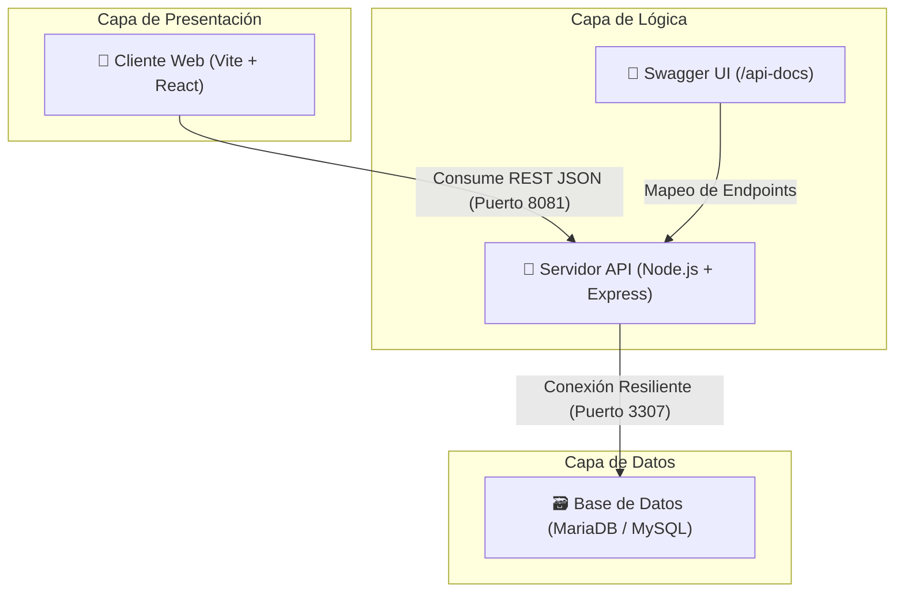

# 🏭 Tecda Maniquí Factory - Tercer Año TECDA

¡Bienvenido a la organización oficial de desarrollo de **Tecda Maniquí Factory**! 

Este espacio de trabajo unifica el diseño, la implementación y la analítica del sistema de producción, inventario y ventas de la fábrica de maniquíes **Tecda**, abarcando las materias de **Gestión de Bases de Datos** y **Prácticas Profesionalizantes** de la tecnicatura.

---

## 🏗️ Arquitectura Desacoplada (3 Capas)

El ecosistema completo se divide en tres componentes totalmente desacoplados e independientes para garantizar modularidad, alta disponibilidad y un flujo de trabajo profesional:



---

## 📂 Repositorios y Componentes del Proyecto

La solución está organizada de forma simétrica en **tres repositorios independientes** dentro de esta organización. Haz clic en cada uno para acceder a su código fuente e instrucciones específicas:

### 1. 🗃️ [tp-maniqui-db](https://github.com/tecda-maniqui-factory/tp-maniqui-db)
* **Responsabilidad:** Capa de Datos (DDL, triggers, stored procedures, vistas analíticas de producción y entornos rápidos con Docker Compose).
* **Puerto local:** `3307` *(exponiendo MariaDB o MySQL)*.
* **Documentación destacada:** [docs/README.md](https://github.com/tecda-maniqui-factory/tp-maniqui-db/blob/main/docs/README.md) *(manual de base de datos y scripts)*.

### 2. 🔌 [tp-maniqui-backend](https://github.com/tecda-maniqui-factory/tp-maniqui-backend)
* **Responsabilidad:** Capa de Negocio y Servicios (API REST de Express, controladores modulares y especificación formal de endpoints).
* **Puerto local:** `8081` *(para evitar colisión con el puente local de WhatsApp)*.
* **Documentación destacada:**
  * [docs/openapi.yaml](https://github.com/tecda-maniqui-factory/tp-maniqui-backend/blob/main/docs/openapi.yaml) *(Especificación OpenAPI 3.0)*.
  * [docs/api_tests.http](https://github.com/tecda-maniqui-factory/tp-maniqui-backend/blob/main/docs/api_tests.http) *(Suite interactiva de REST Client para pruebas rápidas)*.

### 3. 🎨 [tp-maniqui-frontend](https://github.com/tecda-maniqui-factory/tp-maniqui-frontend)
* **Responsabilidad:** Capa de Presentación (Dashboard de control administrativo responsivo Bento Box con estética Obsidian Glassmorphism).
* **Puerto local:** `5173`.
* **Documentación destacada:** [docs/README.md](https://github.com/tecda-maniqui-factory/tp-maniqui-frontend/blob/main/docs/README.md) *(manual de diseño visual y componentes)*.

---

## ⚡ Guía de Inicio Rápido para Desarrolladores

Para levantar el ecosistema completo localmente en tu entorno Manjaro Linux con ZSH:

### Paso 1: Levantar la Base de Datos
```bash
git clone https://github.com/tecda-maniqui-factory/tp-maniqui-db.git
cd tp-maniqui-db/docker/mariadb
docker compose up -d
```

### Paso 2: Levantar el Servidor Backend
```bash
git clone https://github.com/tecda-maniqui-factory/tp-maniqui-backend.git
cd tp-maniqui-backend
pnpm install
pnpm dev
```

### Paso 3: Levantar el Cliente Frontend
```bash
git clone https://github.com/tecda-maniqui-factory/tp-maniqui-frontend.git
cd tp-maniqui-frontend
pnpm install
pnpm dev
```

---
> [!TIP]
> **Gestión de dependencias:** Todos los subproyectos de Node en esta organización tienen como estándar mandatorio y exclusivo el uso de **`pnpm`** para garantizar instalaciones veloces y optimización de caché en disco.
